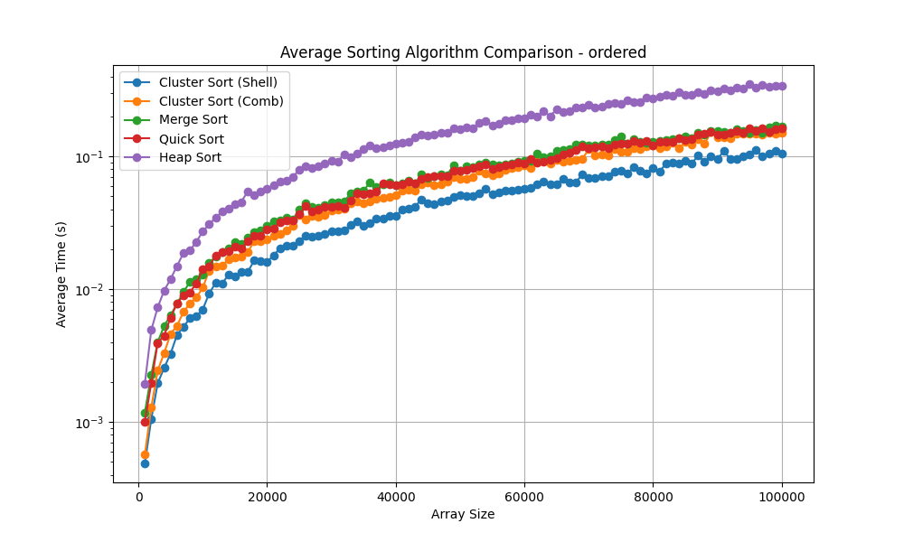

# **Hybrid Clustering-Based In-Place Sorting Algorithm (submitted to journal)**
**A Hybrid Clustering Based In-Place Sorting Algorithm: Performance Evaluation Against Quick Sort, Merge Sort, and Heap Sort**

## **Authors**
- **Mohit Subramaniam (21BPS1617)**
- **Tanya Tripathi (21BPS1595)**
- **Mentor**: **Dr. Omkumar CU**, Assistant Professor, School of Computer Science and Engineering, VIT Chennai

## **Project Overview**
This project presents a novel approach to sorting algorithms using a **Hybrid Clustering-Based In-Place Sorting Algorithm** known as **Cluster Sort**. The focus is on reducing the number of comparisons and enhancing efficiency by exploiting data locality and clustering similar elements.

## **Key Features**
- **In-Place Sorting**: The algorithm optimizes memory usage by performing sorting operations directly within the original array.
- **Interleaved Mechanism**: Enhances efficiency by simultaneously clustering and sorting, preventing the need for additional data structures.
- **Hybrid Approach**: Combines Comb Sort and Shell Sort for efficient intra-cluster sorting.
- **Optimized for Data Patterns**: Effective on datasets with natural clustering, such as Gaussian or ordered data.

## Gallery

 
  
  
  
  
  
 

 

## **Project Architecture**
### **Architecture Diagram**

 

 
  

## **Methodology and In-Place Interleaved Mechanism**
The methodology is divided into several phases, with a focus on maintaining in-place operations and using an interleaved clustering and sorting approach.

### **1. Clustering Phase**
The first phase involves dividing the dataset into smaller, manageable clusters based on similarity. Here's how it works:

- **Similarity Threshold**: The algorithm determines a threshold based on the range of values in the dataset. Elements are assigned to the same cluster if the difference between them does not exceed this threshold.
- **Dynamic Clustering**:
  - Calculate the `min_value` and `max_value` of the dataset.
  - Define `cluster_size` as `(max_value - min_value) / num_clusters`.
  - For each element `x` in the dataset:
    - Compute `cluster_index = min(int((x - min_value) / cluster_size), num_clusters - 1)`.
    - Place the element into the appropriate cluster.

**Mechanism**:
- **In-Place Clustering**: Elements are not copied to separate arrays. Instead, they are rearranged within the original array based on their cluster indices, preserving the in-place property.

### **2. Sorting Phase (Interleaved Mechanism)**
The algorithm employs an interleaved mechanism where clustering and sorting occur simultaneously:
- **Interleaved Sorting**: Once an element is placed into its cluster, the algorithm immediately applies an optimized sorting strategy (Comb or Shell Sort) on that cluster, refining the order as elements are added.
- **Why In-Place?**
  - The use of in-place sorting techniques ensures that no additional arrays or large data structures are needed.
  - During the clustering and sorting process, elements are directly swapped within the original array, adhering to memory efficiency.

### **3. Merging Phase**
- After sorting, clusters are sequentially merged back into the original array.
- **In-Place Merging**: The merging process involves iterating through each sorted cluster and placing elements in their correct order without using extra space.

## **Flowchart**
<h3 align="center">Program 1</h3>

 

 

<h3 align="center">Program 2</h3>

 

 

<h3 align="center">Program 3</h3>

 

 
___

## **Clustering and Sorting Algorithms Explained**
### **Cluster Sort (Comb)**
- **Clustering Step**: Uses data locality principles to group elements with minimal comparisons.
- **Sorting Step**: Applies Comb Sort on each cluster, progressively reducing gaps to refine order.

### **Cluster Sort (Shell)**
- **Clustering Step**: Dynamically groups elements into clusters based on their value proximity.
- **Sorting Step**: Utilizes Shell Sort, performing incremental gap-based sorting within clusters.

### **Complexity Analysis Table**
| Algorithm            | Best Case   | Average Case  | Worst Case  |
|----------------------|-------------|---------------|--------------|
| Cluster Sort (Comb)  | O(n)        | O(n log n)    | O(n^2)       |
| Cluster Sort (Shell) | O(n)        | O(n log n)    | O(n^2)       |
| Quick Sort           | O(n log n)  | O(n log n)    | O(n^2)       |
| Merge Sort           | O(n log n)  | O(n log n)    | O(n log n)   |
| Heap Sort            | O(n log n)  | O(n log n)    | O(n log n)   |

## **Results and Analysis**
### **Datasets Used**
- The algorithms were tested on datasets with unique characteristics, including Gaussian, ordered, repeated values, reverse-ordered, uniform, and combinations of ascending and descending subarrays.

### **Performance Summary**
1. **Gaussian Dataset**: **Cluster Sort (Comb)** improved performance over Heap Sort by 24.5%.
2. **Ordered Dataset**: **Cluster Sort (Shell)** was 69.81% faster than Heap Sort.
3. **Repeated Values**: **Quick Sort** performed best, but Cluster Sort (Shell) outperformed Merge Sort by 57.3%.
4. **Reverse Ordered**: **Cluster Sort (Shell)** was 53.01% faster than Heap Sort.
5. **Uniform Dataset**: Minimal performance differences; **Cluster Sort (Comb)** showed slight improvements over Heap Sort.

### **Future Work**
1. **Scalability Testing**: Extend evaluations to larger datasets (>1 million elements) for deeper insights.
2. **Enhanced Clustering Techniques**: Explore adaptive clustering based on data patterns for improved efficiency.

## **How to Run**
### **Prerequisites**
- Python 3.12.3
- Libraries: `pandas`, `matplotlib`, `numpy`

### **Execution Steps**
1. Clone the repository and navigate to the project directory.
2. Run `program1_dataset_retrieval.py` to load and preprocess datasets.
3. Execute `program2_sorting_benchmark.py` for sorting and benchmarking.
4. Analyze results using `program3_analysis_visualization.py`.
5. Output files and visualizations are stored in the `Results` folder.

